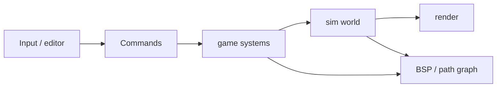

# Architecture

## Goals

- Separate **simulation core**, **game logic**, and **rendering** so each can change independently.
- Keep the sim pure and testable without a window or raylib.
- Preserve a path to 3D by isolating draw/input behind adapters.

## Layers

```
cmd/this-city     → wires loop, owns process lifetime
internal/editor   → tools, placement, path authoring UI
internal/render   → raylib draw + raw input → commands
internal/game     → agent/event/schedule systems
internal/sim      → ECS world, FSM, paths, BSP, math
```

### Dependency rules

| Package | May import | Must not import |
|---------|------------|-----------------|
| `sim` | stdlib only (and later pure deps) | `game`, `render`, `editor`, raylib |
| `game` | `sim` | `render`, `editor`, raylib |
| `render` | `sim`, `game` (read models / commands), raylib | mutating sim except via public command APIs |
| `editor` | `sim`, `game`, `render` | — |
| `cmd` | all of the above | business logic beyond wiring |

**Hard rule:** `internal/sim` never imports raylib or UI packages.

## Data flow

1. Main loop advances a fixed or clamped `dt`.
2. Editor/input produces **commands** (place agent, add path segment, pause).
3. `game` systems apply commands and tick FSMs, path followers, perception.
4. `render` reads world state (read-only view or snapshot) and draws.
5. Spatial indexes (BSP, path graph) rebuild or update when geometry commands land.



## Package responsibilities

### `sim`

- Entity IDs, component stores, system runner hooks (or leave runner in `game`).
- Transform/velocity math, Bezier path data, path-follower math.
- FSM engine (generic states/transitions).
- BSP and path-graph structures + query algorithms.
- Time helpers, seeded RNG for deterministic tests.
- Procedural noise (`sim/noise`: Perlin, Simplex, OpenSimplex, Worley).

### `game`

- Role-specific systems: civilian, police, events, schedules.
- Wiring FSMs to components and world queries.
- Win/lose-free sandbox rules for now; later “scenario” logic lives here.

### `render`

- Window, camera (2D overhead first), draw paths/agents/events.
- Translate keyboard/mouse into editor or game commands.
- No agent AI, no path math beyond display.

### `editor`

- Toolbar state machine (which tool is active).
- Placement previews, selection, Bezier edit handles.
- Pause / resume sim while editing.

### `cmd/this-city`

- `main`: init window, construct world, run loop until close.

## API boundaries

- Prefer **commands** into `game`/`sim` over letting render mutate components directly.
- Prefer **read views** (methods that return copies or const-style accessors) for drawing.
- When 3D arrives, extend transforms/camera in `sim`/`render`; keep FSM and role logic stable.

## Non-goals (architecture)

- Networking / multiplayer.
- Plugin DLL loading.
- Third-party ECS framework (hand-roll minimal first; revisit if needed).

See also: [ecs.md](ecs.md), [rendering.md](rendering.md), [testing.md](testing.md).
